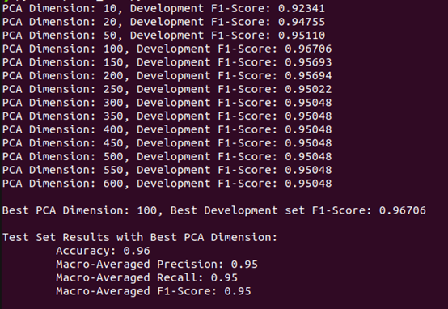

# CourseWork1 Part 2

**Name:** Qiang Fu

**Student ID:** 20462588

### [NOTE] There are 4 files, please make sure they are in the same path in linux.

### Platform and libraries version

**Brief introduction**
This project explores machine learning methods for text classification, including preprocessing, feature engineering, and model training, through a classification task on ‘bbc-text.csv’ data.

### Before preprocessing
Please put the 'bbc-text.csv' file in the same path as the part2.py file

### Please create a virtual environment according to the following installation package, you can use venv, or virtualenv, or anaconda to set a virtual environment

**Operating System:** ubuntu 20.04.2

**GNU version:** GNU 9.4.0

**Python version:** python 3.9.20
 
**Pandas version:** pandas 2.2.3

**Numpy version:** numpy 1.26.4

**Scikit-learn version:** scikit-learn 1.5.2

**Spacy version:** spacy 3.8.2

**Nltk version:** nltk 3.9.1

**Gensim version:** gensim 4.3.3

### Here, use anaconda for the demonstration (please type the instruction below in your CLI)

**Install the necessary dependencies**
>sudo apt install libgl1-mesa-glx libegl1-mesa libxrandr2 libxrandr2 libxss1 libxcursor1 libxcomposite1 libasound2 libxi6 libxtst6

**Download conda**
>sudo wget https://repo.anaconda.com/archive/Anaconda3-2022.10-Linux-x86_64.sh

**Update the environment variable**
>~/.bashrc

[NOTE] When you open bashrc file, you need to add two following texts in bashrc file.
>export PATH=~/anaconda3/bin:$PATH
source ~/anaconda3/bin/activate

Then, you need to restart your linux or type the following instruction in your linux CLI
>source ~/.bashrc

**Create and activate the new virtual environment**
The following instruction will create a virtual python environment called NLP
>conda create -n NLP python=3.9

The follwing instruction will activate the environment called NLP
>conda activate NLP

Please use the follwing instruction format to download python packages
>conda install

e.g. conda install numpy

### Before using this virtual environment, you need to download the stop-words, Please type the following instruction in your CLI.
>python

>import nltk

>nltk.download('stopwords')

when there is a mark 'True' in the CLI, you can exit python, please type the instruction below in your CLI.

>exit()

### If you want get the whole results, you need to activate the virtual environment first ,and then you can type this instruction below or paste it in your linux CLI

>python part2.py

### The calculation result is displayed on the linux CLI
The output results will include Accuracy, Macro Precision, Macro Recall, Macro F1-Score and Average accuracy, Average Macro Precision, Average Macro Recall, Average Macro F1-Score. The picture below shows the result.

